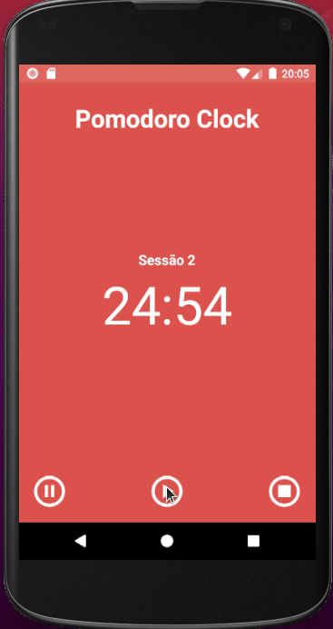

# Pomodoro Clock

Aplicativo para auxiliar na produtividade da rotina de trabalho.

# Features
Requisitos retirados do repositório [Apps Ideias](https://github.com/florinpop17/app-ideas)

- [x] Usuário pode visualizar um sessão de trabalho de 25 minutos.
- [x] Após a sessão de trabalho de 25 minutos, o usuário pode ver uma sessão de 5 minutos para realizar um pausa.
- [x] Usuáriop pode iniciar, pausar, parar ou resetar uma sessão. 

# Tecnologias
As seguintes tecnologias foram utilizadas no projeto:

- [Android](https://developer.android.com/)
- [Kotlin](https://kotlinlang.org/)

# Screencast

<h1>
    
</h1>

# Considerações
Aplicativo desenvolvido com objetivos de divulgar e compatilhar meus conhecimentos sobre Dev Android. 

Feito por Kevin Lucas, me siga no meu [Linkedin](https://www.linkedin.com/in/kevinlucasdev/). Obrigado